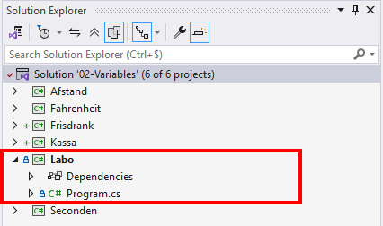
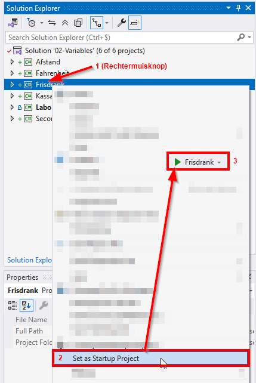

# 02 - Variabelen

Deze repository bevat de oplossingen van de oefeningen van module 2. 

## Getting started

Je kan simpelweg een *clone* maken van deze repository en de *solution* openen in Visual Studio.

In de *Solution Explorer* krijg je een overzicht van de verschillende projecten. Je kan elk project uitklappen en het `Program.cs`-bestand openen in de *editor*.

## Uitvoeren

Deze solution bevat meerdere projecten (elke oefening is een aparte consoleapplicatie). Je kan deze niet gelijktijdig starten, maar je kan wel zelf bepalen welke applicatie door Visual Studio gestart wordt. 

Klik hiervoor met de rechtermuisknop op de gewenste oefening en selecteer `Set as Startup Project`. Het geselecteerde project zal nu **in het vet** worden weergegeven in de *Solution Explorer*.

De naam van de gekozen applicatie verschijnt als tekst op de *startknop* en wanneer je op de knop klikt zal deze applicatie dan ook worden uitgevoerd.

## Versies

Omdat we met Git en GitHub werken kan een nieuwe versie van deze repository "gesynchroniseerd" worden met het *pull*-commando.